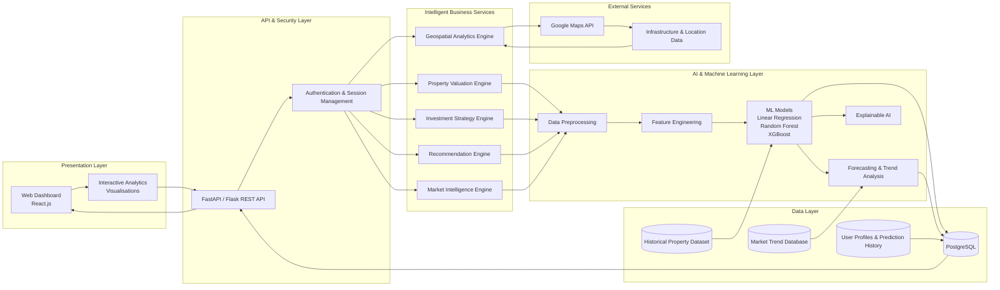

GEOESTATE NEXUS : AI-Driven Property Analytics & Investment Strategy Optimization

Tech Stack : Python • Scikit-learn • XGBoost • Pandas • NumPy • FastAPI/Flask • React.js • PostgreSQL • REST APIs • Google Maps API • Git • Docker

Integrated an AI-powered predictive analytics and decision support platform to estimate residential property purchase 
and rental prices using locality features, property specifications, plot dimensions, price-per-square-foot analysis, and historical market data.

Formulated a machine learning-based forecasting and recommendation engine leveraging 10+ years of Real estate trends to
predict price appreciation/depreciation, estimate future property valuations, evaluate investment potential, and generate
actionable market insights. Designed geospatial intelligence and scalable REST APIs to analyze infrastructure growth 
indicators (metro, airport, commercial developments), perform comparative locality analytics, and deliver personalized 
property recommendations for informed investment decisions. 

Features :

•	 AI-powered property price prediction for purchase and rental properties. 

•	 Future price appreciation and depreciation forecasting using historical market trends. 

•	 Geospatial analysis based on location, infrastructure, and nearby amenities. 

•	 Interactive market analytics dashboard with pricing trends and comparative insights. 

•	 Locality comparison engine for evaluating multiple neighbourhoods. 

•	 Investment recommendation system with ROI and growth potential analysis. 

•	 Explainable AI to highlight the key factors influencing each prediction. 

•	 RESTful APIs for seamless frontend-backend communication. 

•	 Secure authentication and user-specific prediction history. 

System Architecture : 

