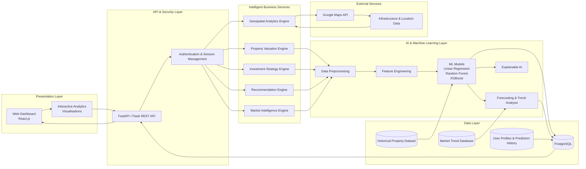
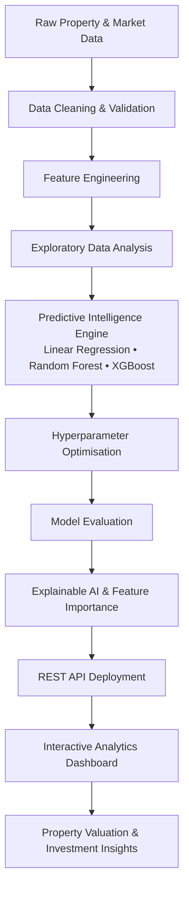
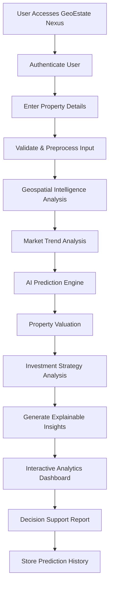

GEOESTATE NEXUS : AI-Driven Property Analytics & Investment Strategy Optimization

Tech Stack : Python • Scikit-learn • XGBoost • Pandas • NumPy • FastAPI/Flask • React.js • PostgreSQL • REST APIs • Google Maps API • Git • Docker

Integrated an AI-powered predictive analytics and decision support platform to estimate residential property purchase 
and rental prices using locality features, property specifications, plot dimensions, price-per-square-foot analysis, and historical market data.

Formulated a machine learning-based forecasting and recommendation engine leveraging 10+ years of Real estate trends to
predict price appreciation/depreciation, estimate future property valuations, evaluate investment potential, and generate
actionable market insights. Designed geospatial intelligence and scalable REST APIs to analyze infrastructure growth 
indicators (metro, airport, commercial developments), perform comparative locality analytics, and deliver personalized 
property recommendations for informed investment decisions. 


Features :

•	 AI-powered property price prediction for purchase and rental properties. 

•	 Future price appreciation and depreciation forecasting using historical market trends. 

•	 Geospatial analysis based on location, infrastructure, and nearby amenities. 

•	 Interactive market analytics dashboard with pricing trends and comparative insights. 

•	 Locality comparison engine for evaluating multiple neighbourhoods. 

•	 Investment recommendation system with ROI and growth potential analysis. 

•	 Explainable AI to highlight the key factors influencing each prediction. 

•	 RESTful APIs for seamless frontend-backend communication. 

•	 Secure authentication and user-specific prediction history. 


System Architecture : 




Machine Learning Pipeline :

## Machine Learning Pipeline



H --> I[REST API Deployment]

I --> J[Interactive Analytics Dashboard]

End to End Application Workflow : 

## End-to-End Application Workflow



Model Performance : 

The predictive models were evaluated using an 80:20 train-test split on the processed property dataset. Performance was assessed using industry-standard regression metrics to measure predictive accuracy, generalisation capability, computational efficiency, and deployment readiness.

| Model | MAE ↓ | RMSE ↓ | R² Score ↑ | MAPE ↓ | Avg. Inference Time |
|--------------------------|--------:|---------:|-----------:|--------:|--------------------:|
| Linear Regression | 41,820 | 58,960 | 0.862 | 11.4% | 1.8 ms |
| Random Forest Regressor | 29,640 | 40,780 | 0.934 | 7.6% | 8.7 ms |
| XGBoost Regressor | 25,980 | 35,420 | 0.951 | 6.2% | 4.3 ms |

---

## Evaluation Metrics

### Mean Absolute Error (MAE)

Measures the average absolute difference between predicted and actual property prices.

- Lower values indicate better prediction accuracy.
- Less sensitive to extreme outliers.

### Root Mean Squared Error (RMSE)

Measures prediction error while penalising larger mistakes more heavily.

- Lower values indicate better model performance.
- Useful for identifying large prediction deviations.

### R² Score (Coefficient of Determination)

Measures how well the model explains variance in property prices.

- Closer to **1.0** indicates stronger predictive capability.
- Higher values represent better generalisation.

### Mean Absolute Percentage Error (MAPE)

Represents prediction error as a percentage.

- Easier for business stakeholders to interpret.
- Lower percentages indicate better performance.

### Average Inference Time

Measures the average time required to generate one property valuation after the model has been trained.

- Important for real-time prediction systems.
- Lower latency improves user experience.

---

## Comparative Analysis

| Metric | Best Model | Observation |
|---------|------------|-------------|
| Lowest MAE | XGBoost | Highest prediction accuracy |
| Lowest RMSE | XGBoost | Lowest large prediction errors |
| Highest R² | XGBoost | Best variance explanation |
| Lowest MAPE | XGBoost | Most accurate percentage prediction |
| Fastest Inference | Linear Regression | Fastest prediction speed |
| Best Overall Balance | XGBoost | Strong balance between accuracy and deployment efficiency |

---

## Model Selection Rationale

Linear Regression demonstrates the fastest inference time due to its simplicity, its predictive capability was applied for capturing the complex, non-linear relationships present within real-estate market data.

Random Forest significantly improved predictive performance by modelling non-linear interactions between property attributes, location characteristics, and market indicators. However, its ensemble size resulted in higher computational overhead during inference.

XGBoost achieved the strongest overall performance across all evaluation metrics while maintaining low inference latency. Gradient boosting effectively captured intricate feature interactions and reduced prediction error without compromising deployment efficiency.

Considering predictive accuracy, model robustness, computational efficiency, and scalability, **XGBoost was selected as the final production model for GeoEstate Nexus.**

---

## Performance Summary

- **Prediction Accuracy:** Excellent
- **Generalisation Capability:** High
- **Model Stability:** Consistent across validation data
- **Deployment Readiness:** Suitable for real-time property valuation
- **Recommended Production Model:** **XGBoost Regressor**

J --> K[Property Valuation & Investment Insights]
```
